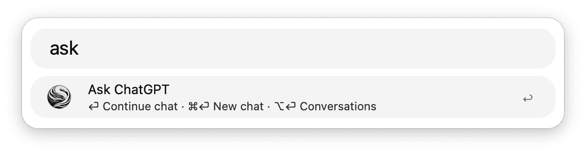
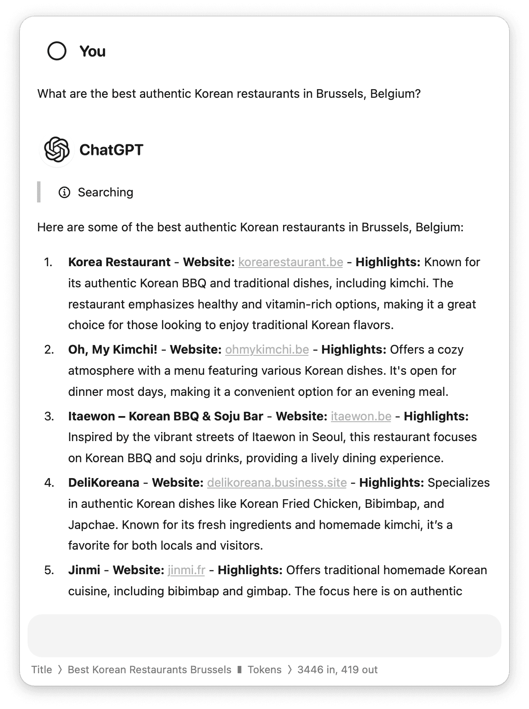
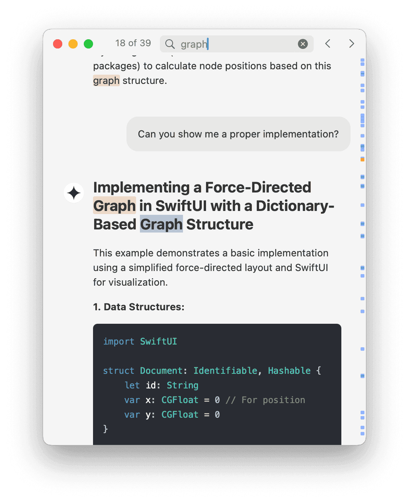

__ChatGPT__, __Claude__, __Perplexity__, and __Gemini__ integrations for chat, real-time information retrieval, and text processing tasks, such as paraphrasing, simplifying, or summarizing. 
With support for third party __proxies__ and __local LLMs__.

---

> [!NOTE] 
> This is an alpha preview version of the workflow.  
> 
---

## 1 / Setup

1. Configure [Hotkeys](https://www.alfredapp.com/help/workflows/triggers/hotkey/) to quickly view the current chat, archive, and inference actions.
* For instance <kbd>⌥⇧A</kbd>, <kbd>⌘⇧A</kbd>, and <kbd>⌥⇧I</kbd> (recommended).
2. Install the [SF Pro](https://developer.apple.com/fonts/) font from Apple to display icons.
3. Enter your API keys for the services you want to use.
4. Configure your proxy or local host settings in the [Environment Variables](https://www.alfredapp.com/help/workflows/advanced/variables/#environment) (optional).
* For example configurations see the [wiki](https://github.com/zeitlings/ayai-gpt-nexus/wiki).
5. Install [pandoc](https://formulae.brew.sh/formula/pandoc#default) to pin conversations (recommended).

## 2 / Usage

### 2.1 __Ayai__ Chat

Converse with your [__Primary__](#primary) via the `ask` keyword, [Universal Action](https://www.alfredapp.com/help/features/universal-actions/), or [Fallback Search](https://www.alfredapp.com/help/features/default-results/fallback-searches/). 

- <kbd>↩</kbd> Continue the ongoing chat.
- <kbd>⌘</kbd><kbd>↩</kbd> Start a new conversation.
- <kbd>⌥</kbd><kbd>↩</kbd> View the chat history.
* __Hidden Option__
	- <kbd>⌘</kbd><kbd>⇧</kbd><kbd>↩</kbd> Open the workflow configuration.
____

#### 2.1.1 Chat Window

- <kbd>↩</kbd> Ask a question.
- <kbd>⌘</kbd><kbd>↩</kbd> Start a new conversation.
- <kbd>⌥</kbd><kbd>↩</kbd> Copy the last answer.
- <kbd>⌃</kbd><kbd>↩</kbd> Copy the full conversation.
- <kbd>⇧</kbd><kbd>↩</kbd> Stop generating an answer.
- <kbd>⌘</kbd><kbd>⌃</kbd><kbd>↩</kbd> View the chat history.

* __Hidden Options__
	- <kbd>⇧⌥⏎</kbd> Show configuration info in HUD
	- <kbd>⇧⌃⏎</kbd> __Speak__ the last answer out loud
	- <kbd>⇧⌘⏎</kbd> Edit __multi-line prompt__ in separate window
		* <kbd>⇧</kbd><kbd>↩</kbd> Switch to Editor / Markdown preview
		* <kbd>⌘</kbd><kbd>↩</kbd> Ask the question.
		* <kbd>⇧⌘⏎</kbd> Start a new conversation.

__Sticky Preview example:__

#### 2.1.2 Chat History

- __Search:__ Type to filter archived chats based on your query.
- <kbd>↩</kbd> Continue archived conversation.
- <kbd>⇥</kbd> Open __conversation details__.
- <kbd>⌃</kbd> View message count, creation and modification date.
- <kbd>⇧</kbd> View message participation details.
- <kbd>⇧</kbd><kbd>⌥</kbd> View available tags or keywords.
- <kbd>⌘</kbd><kbd>↩</kbd> Reveal the chat file in Finder.
- <kbd>⌘</kbd><kbd>L</kbd> Inspect the unabridged preview as [Large Type](https://www.alfredapp.com/help/features/large-type/).
- <kbd>⌘</kbd><kbd>⇧</kbd><kbd>↩</kbd> Send conversation to the trash.

##### *!Bang* Filters

Type `!` to see all filters currently available and hit <kbd>↩</kbd> to apply it.

#### 2.1.3 Conversation Details

Conversations can be marked both as __favorites__ or __pinned__. Pinned conversations will always stay on top, while favorites can be filtered and searched further via the `!fav` bang filter.

- __⌘1__ · Same as above, except
	- <kbd>⇥</kbd> Go back to the chat history.
	- <kbd>⌥</kbd><kbd>↩</kbd> Open __static preview__ of the conversation.
	- <kbd>⌘</kbd><kbd>Y</kbd> (or tap <kbd>⇧</kbd>) Quicklook conversation preview.
- __⌘3__
	- <kbd>⌘</kbd><kbd>L</kbd> Inspect message and token details as [Large Type](https://www.alfredapp.com/help/features/large-type/).

### 2.2 File Attachments

You can use *Ayai* to chat with your documents or attach images to your conversations.

#### 2.2.1 Universal Action: Attach Document

By default, when starting a new conversation or attaching a file to an ongoing chat, a summary will be created. You can also enter an optional prompt that will be taken into account.

Currently supported are __PDF__, __docx__, all __plain text__ and __source code__ files.  
To extract text from docx-files, *Ayai* will use [pandoc](https://formulae.brew.sh/formula/pandoc) if it is installed. Otherwise a crude workaround will be used

- <kbd>↩</kbd> (or <kbd>⌘</kbd><kbd>↩</kbd>) Summarize and ask with optional prompt __starting new chat__.
- <kbd>⌥</kbd><kbd>↩</kbd> Summarize and ask with optional prompt __continuing chat__.
- <kbd>⌘</kbd><kbd>⇧</kbd><kbd>↩</kbd> Don't summarize and ask with prompt starting __new chat__.
- <kbd>⌥</kbd><kbd>⇧</kbd><kbd>↩</kbd> Don't summarize and ask with prompt __continuing chat__.
- <kbd>⌃</kbd><kbd>↩</kbd> Edit multi-line prompt in a separate [Text View](https://www.alfredapp.com/help/workflows/user-interface/text/).
	* There, the same options are available.

#### 2.2.2 Universal Action: Attach Image

### 2.3 Inference Actions[^1]

> Inference Actions provide a suite of language tools for text generation and transformation. These tools enable summarization, clarification, concise writing, and tone adjustment for selected text. They can also correct spelling, expand and paraphrase text, follow instructions, answer questions, and improve text in other ways. 

Access a list of all available actions via the [Universal Action](https://www.alfredapp.com/help/features/universal-actions/) or by setting the [Hotkey](https://www.alfredapp.com/help/workflows/triggers/hotkey/) trigger.

- <kbd>↩</kbd> Generate the result using the configured default strategy.
- <kbd>⌘</kbd><kbd>↩</kbd> __Paste__ the result and replace selection.
- <kbd>⌥</kbd><kbd>↩</kbd> __Stream__ the result and preserve selection.
- <kbd>⌃</kbd><kbd>↩</kbd> __Copy__ the result to clipboard.

__Tip:__ Write a detailed prompt directly into the Inference Action filter to customize your instruction or question.

#### Inference Action Customization

The inference actions are generated from a JSON file called `actions.json`, located in the workflow folder. You can customize existing actions or add new ones by editing the file directly or by editing `actions.config.pkl` and then evaluating this file with [pkl](https://github.com/apple/pkl).

> [!IMPORTANT] 
> Always back up your customized Inference Actions before updating the workflow or your changes will be lost.

## 3 / Prompting

> A prompt is the text that you give the model to elicit, or "prompt," a relevant output. A prompt is usually in the form of a question or instructions.

### References

- [General prompt engineering guide](https://www.promptingguide.ai/)
- [OpenAI prompt engineering guide](https://platform.openai.com/docs/guides/prompt-engineering) | [Prompt Gallery](https://platform.openai.com/docs/examples)
- [Anthropic prompt engineering guide](https://docs.anthropic.com/en/docs/prompt-engineering) | [Prompt Gallery](https://docs.anthropic.com/en/prompt-library/library) 
- [Google AI prompt engineering guide](https://ai.google.dev/gemini-api/docs/prompting-intro) | [Prompt Gallery](https://ai.google.dev/gemini-api/prompts)

## 4 / Configuration

### Primary 

The *primary* configuration setting determines the service that is used for conversations.

#### OpenAI Proxies[^2]

If you want to use a third party proxy, define the correlating `host`, `path`, `API key`, `model`, and if required the `url scheme` or `port` in the [environment variables](https://www.alfredapp.com/help/workflows/advanced/variables/#environment).
The variables are prefixed as alternatives to OpenAI, because *Ayai* expects the returned stream events and errors to mirror the shape of those returned by the OpenAI API.

#### Local LM's[^3]

If you want to use a local language model, define the correlating `url scheme`, `host`, `port`, `path`, and if required the `model` in the [environment variables](https://www.alfredapp.com/help/workflows/advanced/variables/#environment) to establish a connection to the local HTTP initiated and maintained by the method of your choice.
The variables are prefixed as alternatives to OpenAI, because *Ayai* expects the returned stream events and errors to mirror the shape of those returned by the OpenAI API.

__Note__: Additional stop sequences can be provided via the shared `finish_reasons` environment variable.

[^1]: *Ayai* will make sure that the frontmost application accepts text input before streaming or pasting, and will simply copy the result to the clipboard if it does not. This requires [accessibility access](https://support.apple.com/guide/mac-help/allow-accessibility-apps-to-access-your-mac-mh43185/mac), which you may need to grant in order to use inference actions.  __Note:__ You can override this behaviour with the *Safety Exception* configuration option.   
[^2]: Third party proxies such as [OpenRouter](https://openrouter.ai/), [Groq](https://groq.com/), [Fireworks](https://fireworks.ai/)  or [Together.ai](https://www.together.ai/) (see [wiki](https://github.com/zeitlings/ayai-gpt-nexus/wiki))  
[^3]: Local HTTP servers can be set up with interfaces such as [LM Studio](https://lmstudio.ai/) or [Ollama](https://ollama.com/)